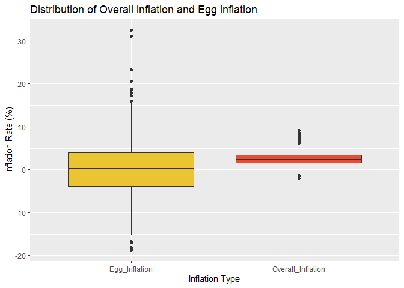

Descriptive Statistics
================

<table class="gt_table" data-quarto-disable-processing="false" data-quarto-bootstrap="false">
  <thead>
    <tr class="gt_heading">
      <td colspan="3" class="gt_heading gt_title gt_font_normal gt_bottom_border" style>Descriptive Statistics for Inflation Data</td>
    </tr>
    &#10;    <tr class="gt_col_headings">
      <th class="gt_col_heading gt_columns_bottom_border gt_left" rowspan="1" colspan="1" scope="col" id="Statistic">Statistic</th>
      <th class="gt_col_heading gt_columns_bottom_border gt_right" rowspan="1" colspan="1" scope="col" id="Overall_Inflation">Overall_Inflation</th>
      <th class="gt_col_heading gt_columns_bottom_border gt_right" rowspan="1" colspan="1" scope="col" id="Egg_Inflation">Egg_Inflation</th>
    </tr>
  </thead>
  <tbody class="gt_table_body">
    <tr><td headers="Statistic" class="gt_row gt_left">n</td>
<td headers="Overall_Inflation" class="gt_row gt_right">300.000</td>
<td headers="Egg_Inflation" class="gt_row gt_right">300.000</td></tr>
    <tr><td headers="Statistic" class="gt_row gt_left gt_striped">missing</td>
<td headers="Overall_Inflation" class="gt_row gt_right gt_striped">6.000</td>
<td headers="Egg_Inflation" class="gt_row gt_right gt_striped">6.000</td></tr>
    <tr><td headers="Statistic" class="gt_row gt_left">mean</td>
<td headers="Overall_Inflation" class="gt_row gt_right">2.579</td>
<td headers="Egg_Inflation" class="gt_row gt_right">0.642</td></tr>
    <tr><td headers="Statistic" class="gt_row gt_left gt_striped">median</td>
<td headers="Overall_Inflation" class="gt_row gt_right gt_striped">2.250</td>
<td headers="Egg_Inflation" class="gt_row gt_right gt_striped">0.191</td></tr>
    <tr><td headers="Statistic" class="gt_row gt_left">sd</td>
<td headers="Overall_Inflation" class="gt_row gt_right">1.790</td>
<td headers="Egg_Inflation" class="gt_row gt_right">7.488</td></tr>
    <tr><td headers="Statistic" class="gt_row gt_left gt_striped">min</td>
<td headers="Overall_Inflation" class="gt_row gt_right gt_striped">−2.100</td>
<td headers="Egg_Inflation" class="gt_row gt_right gt_striped">−18.772</td></tr>
    <tr><td headers="Statistic" class="gt_row gt_left">max</td>
<td headers="Overall_Inflation" class="gt_row gt_right">9.100</td>
<td headers="Egg_Inflation" class="gt_row gt_right">32.393</td></tr>
    <tr><td headers="Statistic" class="gt_row gt_left gt_striped">range</td>
<td headers="Overall_Inflation" class="gt_row gt_right gt_striped">11.200</td>
<td headers="Egg_Inflation" class="gt_row gt_right gt_striped">51.165</td></tr>
    <tr><td headers="Statistic" class="gt_row gt_left">Q1.25%</td>
<td headers="Overall_Inflation" class="gt_row gt_right">1.600</td>
<td headers="Egg_Inflation" class="gt_row gt_right">−3.813</td></tr>
    <tr><td headers="Statistic" class="gt_row gt_left gt_striped">Q3.75%</td>
<td headers="Overall_Inflation" class="gt_row gt_right gt_striped">3.400</td>
<td headers="Egg_Inflation" class="gt_row gt_right gt_striped">4.004</td></tr>
    <tr><td headers="Statistic" class="gt_row gt_left">IQR</td>
<td headers="Overall_Inflation" class="gt_row gt_right">1.800</td>
<td headers="Egg_Inflation" class="gt_row gt_right">7.817</td></tr>
    <tr><td headers="Statistic" class="gt_row gt_left gt_striped">skewness</td>
<td headers="Overall_Inflation" class="gt_row gt_right gt_striped">1.065</td>
<td headers="Egg_Inflation" class="gt_row gt_right gt_striped">0.570</td></tr>
    <tr><td headers="Statistic" class="gt_row gt_left">kurtosis</td>
<td headers="Overall_Inflation" class="gt_row gt_right">5.322</td>
<td headers="Egg_Inflation" class="gt_row gt_right">5.071</td></tr>
  </tbody>
  &#10;  
</table>

<!-- -->
