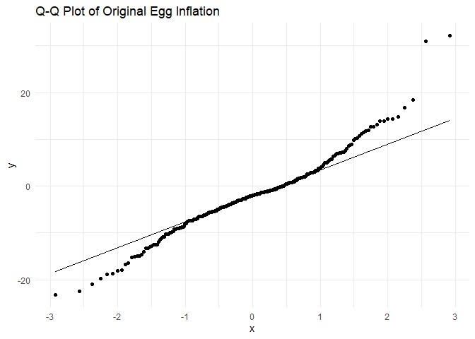
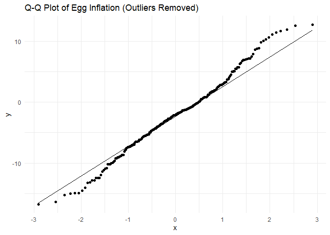
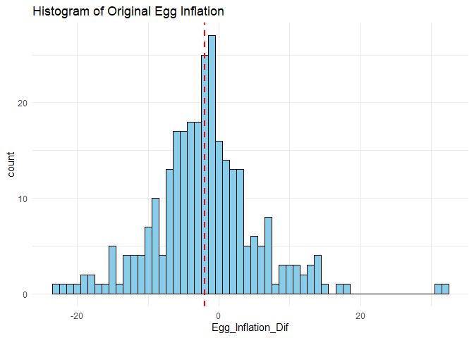
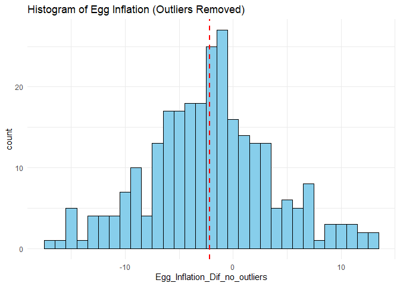

Normality test
================
2024-08-01

## Normality Tests

# Display plots

``` r
print(qqplot_original)
```

<!-- -->

``` r
print(qqplot_no_outliers)
```

<!-- -->

``` r
print(histogram_original)
```

<!-- -->

``` r
print(histogram_no_outliers)
```

<!-- -->

``` r
print(qqplot_egg_original)
```

<!-- -->

``` r
print(qqplot_egg_no_outliers)
```

<!-- -->

``` r
print(histogram_egg_original)
```

<!-- -->

``` r
print(histogram_egg_no_outliers)
```

<!-- -->

# Shapiro-Wilk test for normality

``` r
print(shapiro_test_original)
```

    ## 
    ##  Shapiro-Wilk normality test
    ## 
    ## data:  inflation_long$Overall_Inflation
    ## W = 0.96145, p-value = 6.232e-07

``` r
print(shapiro_test_no_outliers)
```

    ## 
    ##  Shapiro-Wilk normality test
    ## 
    ## data:  inflation_long_no_outliers$Overall_Inflation_no_outliers
    ## W = 0.98683, p-value = 0.01393

``` r
print(shapiro_test_egg_original)
```

    ## 
    ##  Shapiro-Wilk normality test
    ## 
    ## data:  inflation_long$Egg_Inflation_Dif
    ## W = 0.96084, p-value = 5.161e-07

``` r
print(shapiro_test_egg_no_outliers)
```

    ## 
    ##  Shapiro-Wilk normality test
    ## 
    ## data:  inflation_long__egg_no_outliers$Egg_Inflation_Dif_no_outliers
    ## W = 0.99058, p-value = 0.07932
