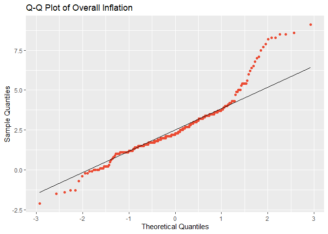
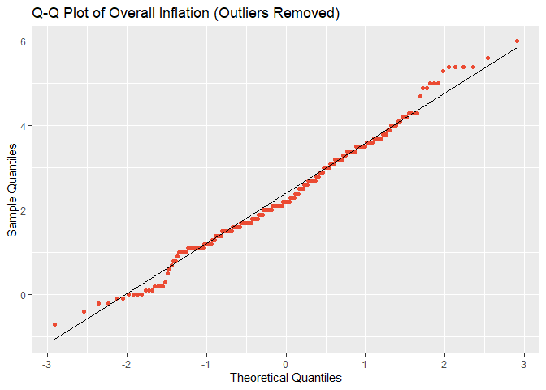

Normality test
================
2024-08-01

## Overall Inflation Plots

<!-- --><!-- --><!-- --><!-- -->

## Egg Inflation Plots

<!-- --><!-- --><!-- --><!-- -->

## Shapiro-Wilk test for normality

### Original Overall

    ## 
    ##  Shapiro-Wilk normality test
    ## 
    ## data:  inflation_long$Overall_Inflation
    ## W = 0.96006, p-value = 3.193e-07

### Original No Outliers

    ## 
    ##  Shapiro-Wilk normality test
    ## 
    ## data:  inflation_long_no_outliers$Overall_Inflation_no_outliers
    ## W = 0.98663, p-value = 0.011

### Original Egg Inflation

    ## 
    ##  Shapiro-Wilk normality test
    ## 
    ## data:  inflation_long$Egg_Inflation_Dif
    ## W = 0.96048, p-value = 3.624e-07

### Egg Inflation No Outliers

    ## 
    ##  Shapiro-Wilk normality test
    ## 
    ## data:  inflation_long__egg_no_outliers$Egg_Inflation_Dif_no_outliers
    ## W = 0.99044, p-value = 0.0691
