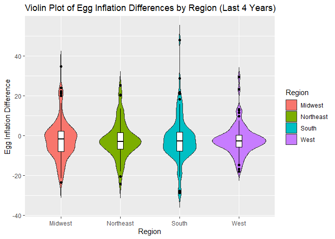

Region Difference Tests
================
2024-08-04

## 25 Years Egg Inflation

### Descriptive Stats

    ## # A tibble: 4 × 6
    ##   Region     Mean Median    SD   Min   Max
    ##   <chr>     <dbl>  <dbl> <dbl> <dbl> <dbl>
    ## 1 Midwest   -2.02  -1.79  9.88 -23.7  34.6
    ## 2 Northeast -2.26  -3.05  9.13 -24.3  25.1
    ## 3 South     -2.12  -2.84 10.9  -28.9  48.0
    ## 4 West      -2.09  -2.84  7.52 -18.0  29.4

### Anova

You can also embed plots, for example:

    ## Call:
    ##    aov(formula = Egg_Inflation_Dif ~ Region, data = long_data)
    ## 
    ## Terms:
    ##                   Region Residuals
    ## Sum of Squares      2.75  37346.58
    ## Deg. of Freedom        3       400
    ## 
    ## Residual standard error: 9.662632
    ## Estimated effects may be unbalanced

    ##              Df Sum Sq Mean Sq F value Pr(>F)
    ## Region        3      3    0.92    0.01  0.999
    ## Residuals   400  37347   93.37

### Tueky’s HSD

    ##   Tukey multiple comparisons of means
    ##     95% family-wise confidence level
    ## 
    ## Fit: aov(formula = Egg_Inflation_Dif ~ Region, data = long_data)
    ## 
    ## $Region
    ##                          diff       lwr      upr     p adj
    ## Northeast-Midwest -0.24559250 -3.966984 3.475799 0.9982433
    ## South-Midwest     -0.10067042 -3.253874 3.052533 0.9997994
    ## West-Midwest      -0.07241998 -3.589405 3.444565 0.9999461
    ## South-Northeast    0.14492208 -3.576469 3.866313 0.9996365
    ## West-Northeast     0.17317252 -3.861086 4.207431 0.9995135
    ## West-South         0.02825044 -3.488735 3.545236 0.9999968

### Kruskal-Wallis Test

    ## 
    ##  Kruskal-Wallis rank sum test
    ## 
    ## data:  Egg_Inflation_Dif by Region
    ## Kruskal-Wallis chi-squared = 0.13902, df = 3, p-value = 0.9868

### Dunn’s Test

    ## Warning: Region was coerced to a factor.

    ## Dunn (1964) Kruskal-Wallis multiple comparison

    ##   p-values adjusted with the Bonferroni method.

    ##            Comparison           Z   P.unadj P.adj
    ## 1 Midwest - Northeast  0.30496087 0.7603960     1
    ## 2     Midwest - South  0.29356327 0.7690916     1
    ## 3   Northeast - South -0.05621927 0.9551671     1
    ## 4      Midwest - West  0.07395662 0.9410449     1
    ## 5    Northeast - West -0.21683646 0.8283358     1
    ## 6        South - West -0.18924176 0.8499033     1

### Violin Plot

<!-- -->

## 4 Years Egg Inflation

### Descriptive Stats

    ## # A tibble: 4 × 6
    ##   Region     Mean Median    SD   Min   Max
    ##   <chr>     <dbl>  <dbl> <dbl> <dbl> <dbl>
    ## 1 Midwest   -3.20  -3.52 10.1  -21.7 22.2 
    ## 2 Northeast -3.32  -3.84 10.8  -24.3 20.3 
    ## 3 South     -3.28  -4.49 11.7  -28.9 21.0 
    ## 4 West      -4.40  -4.01  4.71 -16.8  6.09

### Anova

You can also embed plots, for example:

    ## Call:
    ##    aov(formula = Egg_Inflation_Dif ~ Region, data = long_data)
    ## 
    ## Terms:
    ##                    Region Residuals
    ## Sum of Squares     23.427 13728.535
    ## Deg. of Freedom         3       132
    ## 
    ## Residual standard error: 10.19824
    ## Estimated effects may be unbalanced

    ##              Df Sum Sq Mean Sq F value Pr(>F)
    ## Region        3     23    7.81   0.075  0.973
    ## Residuals   132  13729  104.00

### Tueky’s HSD

    ##   Tukey multiple comparisons of means
    ##     95% family-wise confidence level
    ## 
    ## Fit: aov(formula = Egg_Inflation_Dif ~ Region, data = long_data)
    ## 
    ## $Region
    ##                          diff       lwr      upr     p adj
    ## Northeast-Midwest -0.11669717 -6.400151 6.166757 0.9999593
    ## South-Midwest     -0.08605847 -5.876783 5.704666 0.9999791
    ## West-Midwest      -1.20465008 -8.296810 5.887509 0.9710462
    ## South-Northeast    0.03063870 -6.252815 6.314093 0.9999993
    ## West-Northeast    -1.08795290 -8.587822 6.411916 0.9816007
    ## West-South        -1.11859161 -8.210751 5.973568 0.9765821

### Kruskal-Wallis Test

    ## 
    ##  Kruskal-Wallis rank sum test
    ## 
    ## data:  Egg_Inflation_Dif by Region
    ## Kruskal-Wallis chi-squared = 0.062678, df = 3, p-value = 0.9959

### Dunn’s Test

    ## Warning: Region was coerced to a factor.

    ## Dunn (1964) Kruskal-Wallis multiple comparison

    ##   p-values adjusted with the Bonferroni method.

    ##            Comparison          Z   P.unadj P.adj
    ## 1 Midwest - Northeast 0.01185377 0.9905423     1
    ## 2     Midwest - South 0.08860765 0.9293937     1
    ## 3   Northeast - South 0.06980553 0.9443484     1
    ## 4      Midwest - West 0.23513049 0.8141075     1
    ## 5    Northeast - West 0.21241708 0.8317817     1
    ## 6        South - West 0.16278265 0.8706896     1

### Violin Plot

<!-- -->
